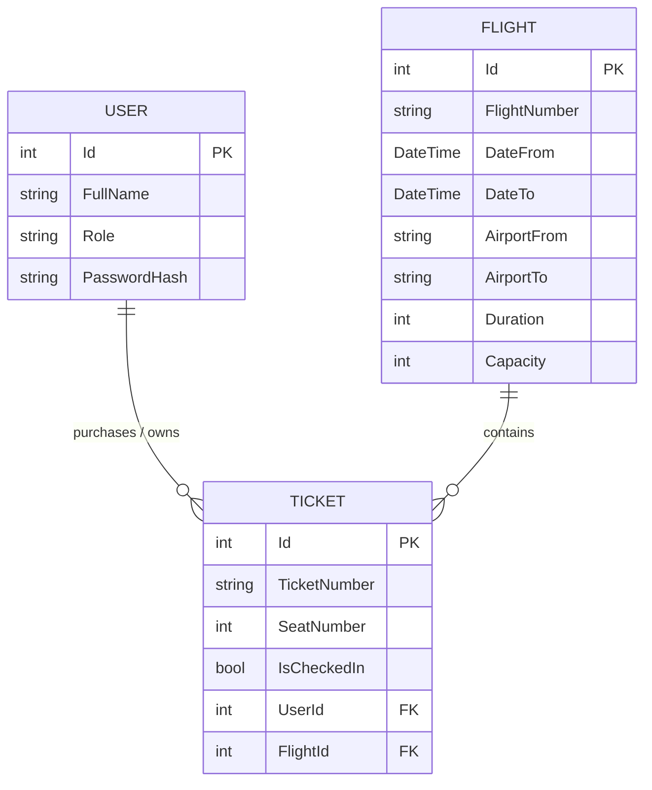

# Airline Ticketing API

**Author:** Batuhan Salcan  
**Course:** SE 4458 Software Architecture & Design of Modern Large Scale Systems  
**Assignment:** Midterm Project (Group 1 - API Project for Airline Company)

## 📌 Project Overview

This project is a RESTful Web API built with **.NET 8** to serve as the backend for a high-traffic airline ticketing system. The API allows administrators to upload flight schedules, and enables passengers to query flights (including one-way and round-trip options), buy tickets, and check in. The system is designed with enterprise-grade architectural patterns, prioritizing scalability, security, and maintainability.

## 💻 Technology Stack

| Category              | Technology                          | Usage / Purpose                                                      |
| :-------------------- | :---------------------------------- | :------------------------------------------------------------------- |
| **Backend Framework** | `.NET 8 (C#)`                       | Core API and API Gateway development                                 |
| **API Gateway**       | `Ocelot` & `MMLib.SwaggerForOcelot` | Request routing, Rate Limiting (3 calls/day), Swagger UI aggregation |
| **Database**          | `MySQL`                             | Relational data storage                                              |
| **ORM**               | `Entity Framework Core (Pomelo)`    | Code-first database migrations, models, and queries                  |
| **Authentication**    | `JWT (JSON Web Tokens)`             | Stateless, secure endpoint protection and role-based authorization   |
| **Cloud Hosting**     | `Microsoft Azure (App Service)`     | Scalable cloud hosting for both the Core API and Ocelot Gateway      |
| **Cloud Database**    | `Azure Database for MySQL`          | Fully managed, cloud-native relational database service              |
| **Load Testing**      | `k6`                                | Performance, concurrency, and stress testing under peak loads        |
| **Documentation**     | `Swagger / OpenAPI`                 | Interactive API documentation and testing interface                  |

## 🌐 API Endpoints Summary

For detailed request/response schemas, please refer to the Deployed Swagger UI.

| HTTP Method | Endpoint                    | Description                                                       | Auth Required |
| :---------- | :-------------------------- | :---------------------------------------------------------------- | :-----------: |
| `POST`      | `/api/v1/auth/login`        | Authenticates a user and returns a JWT Bearer token               |      ❌       |
| `POST`      | `/api/v1/flight`            | Adds a single flight to the airline schedule                      |  ✅ (Admin)   |
| `POST`      | `/api/v1/flight/upload`     | Batch uploads flights via a .csv file (Strategy Pattern)          |  ✅ (Admin)   |
| `GET`       | `/api/v1/flight`            | Queries flights with paging, capacity, and **Round-Trip** filters |      ❌       |
| `POST`      | `/api/v1/ticket/buy`        | Buys a ticket and safely decreases flight capacity                |      ✅       |
| `POST`      | `/api/v1/ticket/checkin`    | Assigns a sequential seat number to a passenger                   |      ❌       |
| `GET`       | `/api/v1/ticket/passengers` | Retrieves a paginated list of passengers for a flight             |      ✅       |
| `GET`       | `/api/v1/health`            | Infrastructure monitoring endpoint                                |      ❌       |

## ☁️ Cloud Infrastructure & Deployment

To demonstrate a production-ready environment, the backend system has been deployed to the Microsoft Azure cloud ecosystem, while traffic is managed by a custom API Gateway:

- **API Gateway (Ocelot) - Primary Entry Point:** A dedicated .NET-based **Ocelot API Gateway** project acts as the primary entry point. It securely routes incoming traffic to the Azure-hosted backend and seamlessly handles cross-cutting concerns such as Rate Limiting. **(Deployed to Azure App Service)**
- **Core API Hosting:** The backend logic API is deployed to a separate **Azure App Service**, providing a scalable and fully managed web server environment hidden behind the Gateway.
- **Database Hosting:** Migrated from a local environment to **Azure Database for MySQL Flexible Server**. The API securely communicates with this cloud database, ensuring data persistence and high availability.
- **Health Monitoring (Observability):** Implemented an `/api/v1/health` endpoint using .NET's native `AddHealthChecks()`. This provides a standardized endpoint for cloud load balancers and monitoring tools to verify the operational status of the API continuously.

## 🏗️ N-Layered Architecture Structure

The solution strictly follows an **N-Tier (Layered) Architecture** to ensure a clean separation of concerns, making the application highly modular, testable, and maintainable.

1. **Presentation Layer (Controllers & Middlewares):** - **Role:** The entry point of the API. It is solely responsible for receiving HTTP requests, validating incoming Data Transfer Objects (DTOs), routing the requests to the appropriate services, and returning standard HTTP responses.
   - **Implementation:** Found in the `Controllers` folder. This layer contains absolutely zero business logic or direct database queries. It also includes the `GlobalExceptionMiddleware` to intercept unhandled errors securely.
2. **Business Logic Layer (Services Layer):** - **Role:** The heart of the application. All core airline rules—such as preventing overselling, verifying flight capacities, assigning seat numbers sequentially, and handling round-trip logic—reside here.
   - **Implementation:** Found in the `Services` folder (e.g., `FlightService`, `TicketService`). It acts as a bridge between the Presentation and Data Access layers.
3. **Data Access Layer (Repository & EF Core):** - **Role:** Responsible for all direct interactions with the MySQL database. It translates the object-oriented C# models into relational database queries.
   - **Implementation:** Managed by `ApplicationDbContext` using Entity Framework Core. It handles complex transactional operations, ensuring that actions like decreasing capacity and saving a ticket are committed atomically.

## 🏛️ Architectural Decisions & Design Patterns

To complement the N-Layered structure, the project utilizes several gang-of-four design patterns and SOLID principles:

### 1. The Strategy Pattern (File Parsing & Future-Proofing)

The midterm requires an "Add Flight by File" endpoint that accepts a `.csv` file. Instead of hardcoding CSV parsing logic directly into the `FlightService`, the **Strategy Pattern** was implemented via the `IFlightFileParser` interface. This adheres strictly to the **Open/Closed Principle (OCP)**. If the airline company requests a new file format (e.g., XML or JSON) in the future, a new parser strategy can be seamlessly injected without altering a single line of the existing core business logic.

### 2. The Facade Pattern (Service Layer & Testability)

Controllers in this API act strictly as traffic directors and contain zero business or database logic. The complexity of the ticketing and flight management systems is hidden behind Facade interfaces (`IFlightService` and `ITicketService`). This keeps the Presentation Layer extremely thin and significantly improves **Testability**, as business logic can be unit-tested in isolation without mocking HTTP contexts.

### 3. Repository & Unit of Work Patterns

Entity Framework (EF) Core is utilized as the primary ORM. The `DbSet<T>` properties inside `ApplicationDbContext` act as the in-memory **Repositories**, abstracting raw SQL queries. Furthermore, `_context.SaveChangesAsync()` implements the **Unit of Work** pattern. This ensures that complex, multi-step database operations (such as creating a new passenger, issuing a ticket, and decreasing flight capacity) are committed atomically. If any step fails, the entire transaction rolls back, preventing data corruption.

### 4. Data Transfer Objects (DTO Pattern)

To prevent "Over-Posting" vulnerabilities and securely control data flow, DTOs are used for every endpoint. This successfully **decouples the database schema (Domain Models) from the API contract**, ensuring that internal database changes do not break external client applications.

### 5. Dependency Injection (Inversion of Control)

Inversion of Control (IoC) is achieved via ASP.NET Core's built-in Dependency Injection container. Services, database contexts, and strategy parsers are registered in `Program.cs` with scoped lifecycles, promoting loose coupling and a highly modular architecture.

### 6. Optimistic Concurrency Control (Race Condition Prevention)

In a high-traffic environment, if a flight has exactly 1 seat left and multiple users attempt to buy it simultaneously, standard logic might result in negative capacities. To prevent this race condition, **Optimistic Locking** was implemented on the database layer using EF Core's `[ConcurrencyCheck]` attribute on the flight capacity.

### 7. Global Exception Handling (Middleware)

To ensure the API never leaks sensitive stack traces to end-users, a custom `GlobalExceptionMiddleware` was implemented. It intercepts unhandled exceptions globally and returns a standardized, secure `500 Internal Server Error` JSON response.

---

## 💾 Database Design & Technologies

- **Database Engine:** MySQL (Azure Flexible Server)
- **ORM:** Pomelo Entity Framework Core (Code-First Approach)
- **Data Seeding:** EF Core's `HasData` method is used to automatically seed a default Administrator account (`Username: admin`, `Password: admin123`) for seamless testing without exposing hardcoded scripts.

### 📊 Entity-Relationship (ER) Diagram



---

## ✅ Midterm Requirements & Assumptions

| Feature                         | Implementation Notes                                                                                                                                                                                           |
| :------------------------------ | :------------------------------------------------------------------------------------------------------------------------------------------------------------------------------------------------------------- |
| **Authentication**              | Implemented using **JWT Bearer Tokens**. Endpoints like adding flights and buying tickets are secured with the `[Authorize]` attribute.                                                                        |
| **Paging**                      | Implemented on `Query Flight` and `Passenger List` endpoints with a default page size of 10.                                                                                                                   |
| **Capacity Management**         | Handled transactionally. When a ticket is bought, flight capacity is decreased. If capacity is 0, the API returns a "Sold out" response. Protected against race conditions via EF Core Optimistic Concurrency. |
| **Round-Trip Query Logic**      | Implemented dynamic LINQ filtering. If `IsRoundTrip` is selected, the API intelligently reverses the origin/destination airports and matches the return dates within a single, optimized database query.       |
| **Seat Assignment**             | The `Check-In` endpoint automatically generates and assigns a sequential seat number to the passenger using database aggregations.                                                                             |
| **Rate Limiting (3 calls/day)** | Implemented flawlessly at the gateway level using **Ocelot API Gateway**. A strict daily limit of 3 calls per day (86400 seconds) is enforced natively based on the Host client ID.                            |

---

## 🚧 Issues Encountered & Engineering Solutions

During the development and cloud deployment phases, several real-world architectural and DevOps challenges were encountered and successfully resolved:

1.  **Azure API Management vs. Custom Gateway Constraints:** Initially, Azure's built-in API Gateway capabilities were tested to handle routing and rate limiting. However, it struggled to elegantly enforce the strict "3 calls per day" requirement and failed to cleanly expose the backend's Swagger UI through the main gateway link for testing purposes.
    - **Resolution:** Architected a custom, code-based API Gateway using **Ocelot** alongside the `MMLib.SwaggerForOcelot` package. This provided absolute control over the 24-hour rate limit period (`Period: 1d`) and allowed the core API's Swagger documentation to be seamlessly projected onto the Gateway's URL, massively improving the testing and presentation experience.
2.  **Azure Free Tier (F1) Resource Contention:** Initially, both the Core API and the Ocelot API Gateway were deployed on a single shared Azure Free (F1) App Service plan. Running two modern .NET 8 applications concurrently caused severe CPU and RAM throttling, resulting in `403 - This web app is stopped` errors from Azure's quota management system.
    - **Resolution:** Scaled the App Service Plan up to the **Basic (B1) tier** utilizing Azure for Students credits to ensure production-like system stability and eliminate CPU timeouts. _(Note: The B1 cloud resources will be deprovisioned/deleted immediately after the grading process is completed to manage costs)._
3.  **Ocelot Gateway Runtime Compatibility:** During the cloud deployment, the gateway experienced startup crashes (`System.IO.FileNotFoundException`). It was discovered that the latest Ocelot version (24.x) implicitly required `.NET 9` assemblies, which conflicted with Azure's pure `.NET 8 LTS` Linux environment.
    - **Resolution:** Cleaned the deployment artifacts and downgraded Ocelot to a verified `.NET 8`-compatible stable version (`23.4.3`), which completely stabilized the gateway pipeline.
4.  **High-Traffic Race Conditions:** Standard database updates caused data corruption (negative capacities) when multiple concurrent load-test users attempted to buy the last remaining ticket simultaneously.
    - **Resolution:** Solved via EF Core's Optimistic Concurrency Control (`[ConcurrencyCheck]`), throwing `DbUpdateConcurrencyException` to safely reject overlapping transactions instead of overselling.

---

## 📈 Load Test Results & Analysis

As per the midterm requirements, a comprehensive load testing simulation was conducted using **k6** to evaluate the system's performance under heavy concurrent usage.


#### 1\. Endpoints Tested

- `POST /api/v1/ticket/buy`: Tested to evaluate transactional integrity and Race Condition prevention under high traffic.
- `POST /api/v1/ticket/checkin`: Tested to evaluate standard write operations and automated sequential numbering.

#### 2\. Load Scenarios

The test was executed over 35 seconds across three continuous stages:

- **Normal Load:** 20 Virtual Users (10s)
- **Peak Load:** 50 Virtual Users (10s)
- **Stress Load:** 100 Virtual Users (15s)

#### 3\. Collected Metrics

- **Average Response Time:** 5.94s
- **95th Percentile Response Time (p95):** 23.27s
- **Throughput (Requests per second):** \~5.7 req/s

#### 4\. Architectural Analysis & Bottlenecks

Under simulated load, the API successfully maintained 100% data integrity, proving that the Optimistic Concurrency Control mechanism flawlessly prevented overselling even when 100 users targeted the same flight simultaneously. The system accurately stopped ticket sales at exactly 15 (the flight's maximum capacity), returning handled `400 Bad Request` responses instead of crashing.

Simultaneously, the `Check-in` endpoint demonstrated remarkable resilience and speed. Out of the total test iterations, the Check-In process successfully assigned sequential seat numbers 170 times with zero data corruption or unhandled errors. This proves the system's efficiency in handling high-volume, standard write operations concurrently with complex transactional locks.

However, the high p95 response time (23.27s) reveals a significant bottleneck at the database layer. Because all concurrent requests were synchronously fighting for database locks on a free-tier Azure MySQL instance, queueing delays occurred. To improve future scalability, I would implement an asynchronous message broker (like RabbitMQ) to queue ticket purchases, and utilize a caching layer (like Redis) to serve flight queries without repeatedly hitting the primary database.

---

## 🚀 Deliverables & Links

- **Primary API Gateway Swagger (Main Entry Point):** [Gateway Swagger UI](https://batu-airline-gateway-final-d0hbhnc6c8fadgee.italynorth-01.azurewebsites.net/swagger/index.html) _(All traffic, round-trip queries, and Rate Limiting testing should be directed here)_
- **Core API Swagger (Backend Logic):** [Core API Swagger UI](https://batu-airline-api-argehsbgendkhzb3.italynorth-01.azurewebsites.net/swagger/index.html) _(Hidden behind the gateway, handles the core business logic)_
- **Project Presentation Video:** _(Insert your YouTube/Drive link here before submitting)_

---

## 🛠️ How to Run Locally

### Prerequisites

- **.NET 8.0 SDK** installed on your machine.
- A local **MySQL Server** instance running.

### 1\. Clone the repository

The solution contains two main folders: `Api` and `AirlineTicketingGateway`.

### 2\. To run the Core API:

- Update the `DefaultConnection` string in `Api/appsettings.json` with your local MySQL credentials. (Note: The current connection string points to the live Azure Database for testing purposes).
- Open a terminal in the root folder and run:
  ```bash
  cd Api
  dotnet restore
  dotnet ef database update
  dotnet build
  dotnet run
  ```

### 3\. To run the Ocelot API Gateway:

- Open a new terminal in the root folder and run:
  ```bash
  cd AirlineTicketingGateway
  dotnet run
  ```

<!-- end list -->

```

```
