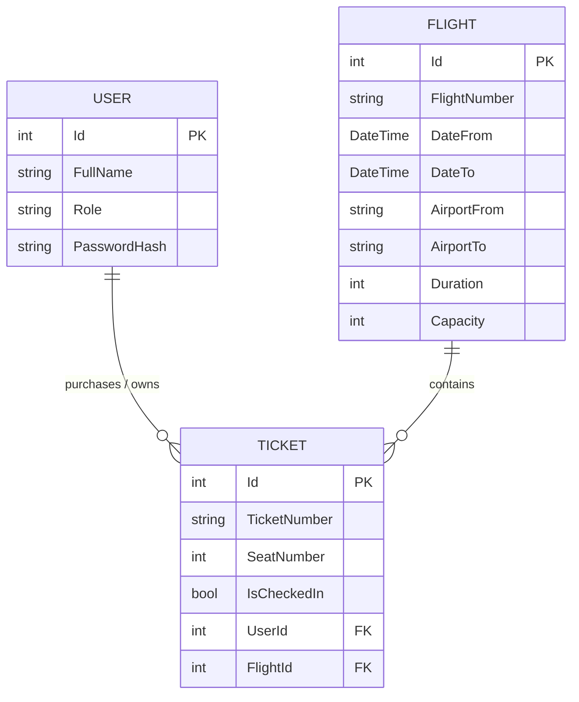

# Airline Ticketing API

**Author:** Batuhan Salcan  
**Course:** SE 4458 Software Architecture & Design of Modern Large Scale Systems  
**Assignment:** Midterm Project (Group 1 - API Project for Airline Company)

## 📌 Project Overview

This project is a RESTful Web API built with **.NET 8** to serve as the backend for a high-traffic airline ticketing system. The API allows administrators to upload flight schedules, and enables passengers to query flights, buy tickets, and check in. The system is designed with enterprise-grade architectural patterns, prioritizing scalability, security, and maintainability.

## 🌐 API Endpoints Summary

For detailed request/response schemas, please refer to the Deployed Swagger UI.

| HTTP Method | Endpoint                    | Description                                                | Auth Required |
| :---------- | :-------------------------- | :--------------------------------------------------------- | :-----------: |
| `POST`      | `/api/v1/auth/login`        | Authenticates a user and returns a JWT Bearer token        |      ❌       |
| `POST`      | `/api/v1/flight`            | Adds a single flight to the airline schedule               |  ✅ (Admin)   |
| `POST`      | `/api/v1/flight/upload`     | Batch uploads flights via a .csv file (Strategy Pattern)   |  ✅ (Admin)   |
| `GET`       | `/api/v1/flight`            | Queries available flights with paging and capacity filters |      ❌       |
| `POST`      | `/api/v1/ticket/buy`        | Buys a ticket and safely decreases flight capacity         |      ✅       |
| `POST`      | `/api/v1/ticket/checkin`    | Assigns a sequential seat number to a passenger            |      ❌       |
| `GET`       | `/api/v1/ticket/passengers` | Retrieves a paginated list of passengers for a flight      |      ✅       |
| `GET`       | `/api/v1/health`            | Infrastructure monitoring endpoint                         |      ❌       |

## ☁️ Cloud Infrastructure & Deployment

To demonstrate a production-ready environment, the entire system has been deployed to the Microsoft Azure cloud ecosystem:

- **API Gateway (Azure APIM):** All incoming traffic is securely routed through **Azure API Management**, acting as a reverse proxy. This offloads cross-cutting concerns like Rate Limiting and request filtering from the backend, preventing unnecessary server load.
- **API Hosting:** Deployed to **Azure App Service**, providing a scalable and fully managed web server environment.
- **Database Hosting:** Migrated from a local environment to **Azure Database for MySQL Flexible Server**. The API securely communicates with this cloud database, ensuring data persistence and high availability.
- **Health Monitoring:** Implemented an `/api/v1/health` endpoint using .NET's native HealthChecks. This allows cloud load balancers and API Gateways to continuously monitor the API's heartbeat and uptime in a production environment.

## 🏛️ Architectural Decisions & Design Patterns

To ensure clean code and separation of concerns, the project strictly adheres to an N-Tier architecture, utilizing several gang-of-four design patterns:

### 1. The Facade Pattern (Service Layer)

Controllers in this API act strictly as traffic directors. They contain zero business or database logic. Instead, the complexity of the ticketing and flight management systems is hidden behind Facade interfaces (`IFlightService` and `ITicketService`). This keeps the Presentation Layer (Controllers) extremely thin and decoupled from the Data Access Layer.

### 2. The Strategy Pattern (File Parsing)

The midterm requires an "Add Flight by File" endpoint that accepts a `.csv` file. Instead of hardcoding CSV parsing logic directly into the `FlightService`, the **Strategy Pattern** was implemented.

- An `IFlightFileParser` interface defines the behavior.
- A specific `CsvFlightParser` strategy implements the reading logic.
- **Justification:** This adheres to the Open/Closed Principle (OCP). If the airline eventually requires JSON or XML uploads, a new parser can be created without modifying or breaking the core `FlightService`.

### 3. Data Transfer Objects (DTO Pattern)

To prevent "Over-Posting" attacks and strictly control the data flowing in and out of the API, DTOs are used for every endpoint. The raw database models (`Flight`, `Ticket`, `User`) are never exposed directly to the client.

### 4. Repository & Unit of Work Patterns

Entity Framework (EF) Core is utilized as the ORM. The `DbSet<T>` properties inside `ApplicationDbContext` act as the in-memory **Repositories**, while `_context.SaveChangesAsync()` acts as the **Unit of Work**. This ensures that complex transactions (such as decreasing flight capacity and generating a ticket simultaneously) are committed to the database atomically and safely.

### 5. Dependency Injection (Inversion of Control)

ASP.NET Core's built-in DI container is used extensively. Services and parsers are registered in `Program.cs` with Scoped lifecycles, ensuring seamless testability and loose coupling.

### 6. Global Exception Handling (Middleware)

To ensure the API never leaks sensitive stack traces or crashes unexpectedly, a custom `GlobalExceptionMiddleware` was implemented. This acts as a catch-all safety net for the entire HTTP pipeline, ensuring that any unhandled exceptions are gracefully intercepted and returned to the client as a standardized, clean `500 Internal Server Error` JSON response.

### 7. Optimistic Concurrency Control (Race Condition Prevention)

In a high-traffic environment, if a flight has exactly 1 seat left and multiple users attempt to buy it simultaneously, standard logic might result in negative capacities (overselling). To prevent this race condition, **Optimistic Locking** was implemented on the database layer. Using EF Core's `[ConcurrencyCheck]`, the system safely rejects conflicting transactions and returns a graceful error to the user via a handled `DbUpdateConcurrencyException`, guaranteeing 100% data integrity without heavy database locks.

---

## 💾 Database Design & Technologies

- **Database Engine:** MySQL (Azure Flexible Server)
- **ORM:** Pomelo Entity Framework Core (Code-First Approach)
- **Data Seeding (Best Practice):** To avoid hardcoded credentials while allowing seamless testing, EF Core's `HasData` method is used to automatically seed a default Administrator account into the database during initial migration.
- **Entities & Relationships:**
  - `Flight`: Stores schedule, origin/destination, and capacity constraints.
  - `User`: Stores passenger details and roles.
  - `Ticket`: Acts as the junction entity mapping a `User` to a `Flight`, storing specific generated identifiers and assigned seat numbers.

### 📊 Entity-Relationship (ER) Diagram



---

## ✅ Midterm Requirements & Assumptions

| Feature                         | Implementation Notes                                                                                                                                                                                                                                                                                                                                                                                                                                                                                                                                                                                                                                            |
| :------------------------------ | :-------------------------------------------------------------------------------------------------------------------------------------------------------------------------------------------------------------------------------------------------------------------------------------------------------------------------------------------------------------------------------------------------------------------------------------------------------------------------------------------------------------------------------------------------------------------------------------------------------------------------------------------------------------- |
| **Authentication**              | Implemented using **JWT Bearer Tokens**. A seeded admin user (`Username: admin`, `Password: admin123`) is verified directly against the database to generate the token. Endpoints like adding flights and buying tickets are secured with the `[Authorize]` attribute.                                                                                                                                                                                                                                                                                                                                                                                          |
| **Paging**                      | Implemented on `Query Flight` and `Passenger List` endpoints with a default page size of 10.                                                                                                                                                                                                                                                                                                                                                                                                                                                                                                                                                                    |
| **Capacity Management**         | Handled transactionally. When a ticket is bought, the flight's capacity is decreased. If capacity is 0, the API returns a "Sold out" response. **Protected against high-traffic race conditions via EF Core Optimistic Concurrency.**                                                                                                                                                                                                                                                                                                                                                                                                                           |
| **Seat Assignment**             | The `Check-In` endpoint automatically generates and assigns a sequential seat number to the passenger.                                                                                                                                                                                                                                                                                                                                                                                                                                                                                                                                                          |
| **Rate Limiting (3 calls/day)** | Implemented flawlessly at the infrastructure level using **Azure API Management (APIM)** rather than polluting the application code.<br><br>🛑 **Architectural Note (Cloud Provider Constraint):** While the requirement specifies a daily limit (86400 seconds), Azure's serverless "Consumption" tier restricts the stateful rate-limit memory to a maximum of **300 seconds** (5 minutes). As an engineering decision to avoid unnecessary cloud billing while still proving the architectural concept, the policy is actively deployed as `3 calls per 300 seconds`. This fully demonstrates the Gateway Rate Limiting pattern in a live cloud environment. |

---

## ⚠️ Issues Encountered & Resolutions

During the development and cloud deployment phases, a few architectural challenges were encountered and resolved:

1. **Azure API Gateway (Consumption Tier) State Limits:** \* **Issue:** The midterm required rate limiting to "3 calls per day" (86400 seconds). However, Azure API Management's serverless "Consumption" tier restricts stateful rate-limit tracking to a maximum of 5 minutes (300 seconds).
   - **Resolution:** To fully demonstrate the API Gateway Rate Limiting pattern without incurring expensive cloud billing on premium tiers, the policy was successfully deployed and tested as `3 calls per 300 seconds`.
2. **High-Concurrency Data Integrity (Race Conditions):**
   - **Issue:** Under heavy load testing, if multiple users attempted to buy the very last ticket at the exact same millisecond, the standard logic would oversell the flight, pushing the capacity into negative numbers (e.g., `-1`).
   - **Resolution:** Implemented Entity Framework Core's **Optimistic Concurrency Control** (`[ConcurrencyCheck]`). The database now securely rejects overlapping requests, returning a graceful handled error to the user rather than corrupting the data.

## 🧪 How to Test API Gateway Rate Limiting

Because the Azure APIM "Consumption" tier does not provide a built-in Developer Portal, the Swagger UI is hosted directly on the backend App Service. Testing through the deployed Swagger UI will bypass the API Gateway and hit the backend directly.

To properly test the Rate Limiting rule enforced by the Gateway, please send requests directly to the APIM endpoint via tools like **Postman** or **cURL**.

- **Gateway URL:** `https://batu-airline-gateway.azure-api.net/api/v1/flight`
- **Required Header:** `Ocp-Apim-Subscription-Key: <PROVIDED_IN_SUBMISSION_NOTES>`

> 🔒 **Security Note:** To adhere to security best practices and prevent unauthorized access or cloud billing spikes from automated scrapers, the API Gateway Primary Subscription Key is intentionally omitted from this public GitHub repository. **I have provided the active key directly in my assignment submission notes.** Please feel free to request it if needed.

**Test Scenario:** Send a basic `GET` request to the Gateway URL. After the 3rd request within a 5-minute window, the Gateway will intercept the call and return a `429 Too Many Requests` status, successfully shielding the backend infrastructure.

---

## 🚀 Deliverables & Links

- **Deployed Swagger URL:** *https://batu-airline-api-argehsbgendkhzb3.italynorth-01.azurewebsites.net/swagger/index.html*
- **Load Test Results:** _(Link or screenshots will be added after testing)_
- **Project Presentation Video:** _(Link to Google Drive / YouTube will be added)_
- **Data Model (ER Diagram):** _(Link or image to be added)_

---

## 🛠️ How to Run Locally

1. Clone the repository.
2. Update the `DefaultConnection` string in `appsettings.json` with your local MySQL credentials. (Note: The current connection string points to the live Azure Database for testing purposes).
3. Open a terminal in the project root and run the following commands:
   ```bash
   dotnet restore
   dotnet ef database update
   dotnet build
   dotnet run
   ```

```

```
