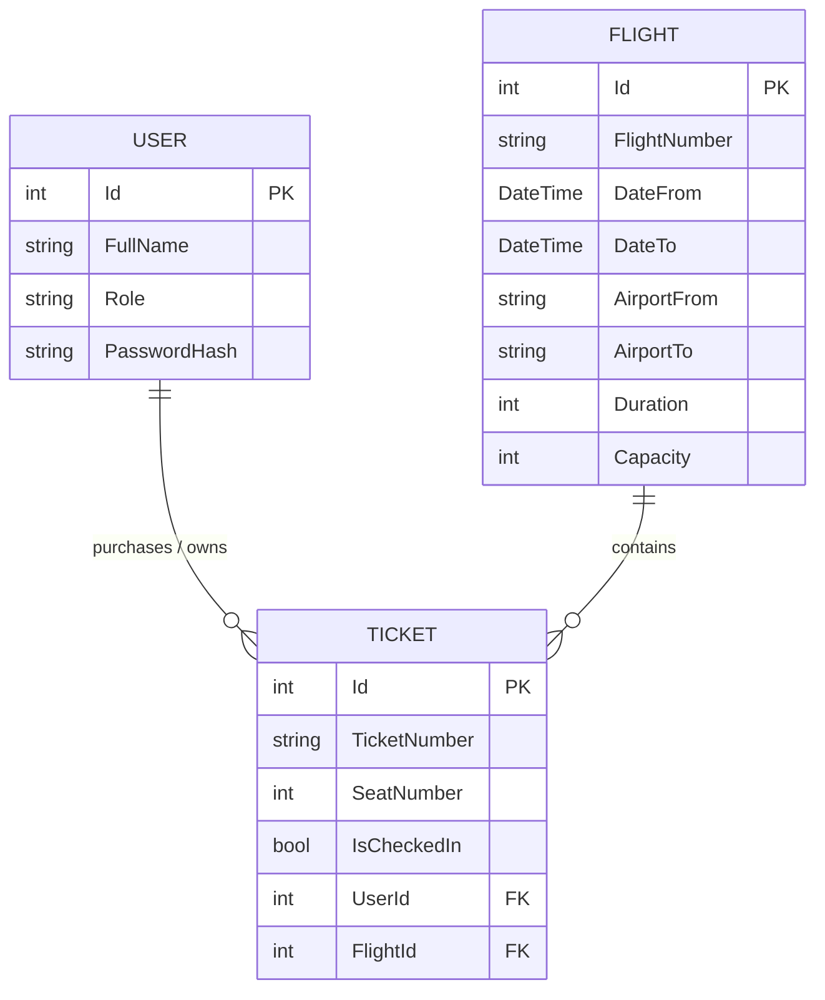

# Airline Ticketing API

**Author:** Batuhan Salcan  
**Course:** SE 4458 Software Architecture & Design of Modern Large Scale Systems  
**Assignment:** Midterm Project (Group 1 - API Project for Airline Company)

## 📌 Project Overview

This project is a RESTful Web API built with **.NET 8** to serve as the backend for a high-traffic airline ticketing system. The API allows administrators to upload flight schedules, and enables passengers to query flights, buy tickets, and check in. The system is designed with enterprise-grade architectural patterns, prioritizing scalability, security, and maintainability.

## 🌐 API Endpoints Summary

For detailed request/response schemas, please refer to the Deployed Swagger UI.

| HTTP Method | Endpoint                    | Description                                                | Auth Required |
| :---------- | :-------------------------- | :--------------------------------------------------------- | :-----------: |
| `POST`      | `/api/v1/auth/login`        | Authenticates a user and returns a JWT Bearer token        |      ❌       |
| `POST`      | `/api/v1/flight`            | Adds a single flight to the airline schedule               |  ✅ (Admin)   |
| `POST`      | `/api/v1/flight/upload`     | Batch uploads flights via a .csv file (Strategy Pattern)   |  ✅ (Admin)   |
| `GET`       | `/api/v1/flight`            | Queries available flights with paging and capacity filters |      ❌       |
| `POST`      | `/api/v1/ticket/buy`        | Buys a ticket and safely decreases flight capacity         |      ✅       |
| `POST`      | `/api/v1/ticket/checkin`    | Assigns a sequential seat number to a passenger            |      ❌       |
| `GET`       | `/api/v1/ticket/passengers` | Retrieves a paginated list of passengers for a flight      |      ✅       |
| `GET`       | `/api/v1/health`            | Infrastructure monitoring endpoint                         |      ❌       |

## ☁️ Cloud Infrastructure & Deployment

To demonstrate a production-ready environment, the backend system has been deployed to the Microsoft Azure cloud ecosystem, while traffic is managed by a custom API Gateway:

- **API Gateway (Ocelot):** A dedicated .NET-based **Ocelot API Gateway** project acts as the primary entry point. It securely routes incoming traffic to the Azure-hosted backend and seamlessly handles cross-cutting concerns such as Rate Limiting. **(Deployed to Azure App Service)**
- **API Hosting:** The core backend API is deployed to a separate **Azure App Service**, providing a scalable and fully managed web server environment.
- **Database Hosting:** Migrated from a local environment to **Azure Database for MySQL Flexible Server**. The API securely communicates with this cloud database, ensuring data persistence and high availability.
- **Health Monitoring:** Implemented an `/api/v1/health` endpoint using .NET's native HealthChecks.

## 🏛️ Architectural Decisions & Design Patterns

To ensure clean code and separation of concerns, the project strictly adheres to an N-Tier architecture, utilizing several gang-of-four design patterns:

### 1. The Facade Pattern (Service Layer)

Controllers in this API act strictly as traffic directors. They contain zero business or database logic. Instead, the complexity of the ticketing and flight management systems is hidden behind Facade interfaces (`IFlightService` and `ITicketService`). This keeps the Presentation Layer extremely thin.

### 2. The Strategy Pattern (File Parsing)

The midterm requires an "Add Flight by File" endpoint that accepts a `.csv` file. Instead of hardcoding CSV parsing logic directly into the `FlightService`, the **Strategy Pattern** was implemented. This adheres to the Open/Closed Principle (OCP).

### 3. Data Transfer Objects (DTO Pattern)

To prevent "Over-Posting" attacks and strictly control the data flowing in and out of the API, DTOs are used for every endpoint. The raw database models are never exposed directly to the client.

### 4. Repository & Unit of Work Patterns

Entity Framework (EF) Core is utilized as the ORM. The `DbSet<T>` properties inside `ApplicationDbContext` act as the in-memory **Repositories**, while `_context.SaveChangesAsync()` acts as the **Unit of Work**, ensuring complex transactions are committed atomically.

### 5. Dependency Injection (Inversion of Control)

ASP.NET Core's built-in DI container is used extensively. Services and parsers are registered in `Program.cs` with Scoped lifecycles.

### 6. Global Exception Handling (Middleware)

To ensure the API never leaks sensitive stack traces, a custom `GlobalExceptionMiddleware` was implemented. It intercepts unhandled exceptions and returns a standardized `500 Internal Server Error` JSON response.

### 7. Optimistic Concurrency Control (Race Condition Prevention)

In a high-traffic environment, if a flight has exactly 1 seat left and multiple users attempt to buy it simultaneously, standard logic might result in negative capacities. To prevent this race condition, **Optimistic Locking** was implemented on the database layer using EF Core's `[ConcurrencyCheck]`.

---

## 💾 Database Design & Technologies

- **Database Engine:** MySQL (Azure Flexible Server)
- **ORM:** Pomelo Entity Framework Core (Code-First Approach)
- **Data Seeding (Best Practice):** To avoid hardcoded credentials while allowing seamless testing, EF Core's `HasData` method is used to automatically seed a default Administrator account (`Username: admin`, `Password: admin123`).

### 📊 Entity-Relationship (ER) Diagram



---

## ✅ Midterm Requirements & Assumptions

| Feature                         | Implementation Notes                                                                                                                                                                                                                  |
| :------------------------------ | :------------------------------------------------------------------------------------------------------------------------------------------------------------------------------------------------------------------------------------ |
| **Authentication**              | Implemented using **JWT Bearer Tokens**. Endpoints like adding flights and buying tickets are secured with the `[Authorize]` attribute.                                                                                               |
| **Paging**                      | Implemented on `Query Flight` and `Passenger List` endpoints with a default page size of 10.                                                                                                                                          |
| **Capacity Management**         | Handled transactionally. When a ticket is bought, the flight's capacity is decreased. If capacity is 0, the API returns a "Sold out" response. **Protected against high-traffic race conditions via EF Core Optimistic Concurrency.** |
| **Seat Assignment**             | The `Check-In` endpoint automatically generates and assigns a sequential seat number to the passenger.                                                                                                                                |
| **Rate Limiting (3 calls/day)** | Implemented flawlessly at the gateway level using **Ocelot API Gateway** rather than polluting the application code. A strict daily limit of 3 calls per day (86400 seconds) is enforced natively based on the Host client ID.        |

---

## 🧪 How to Test API Gateway Rate Limiting

The API Gateway is built using **Ocelot** and is actively deployed to Azure. To test the "3 calls/day" rate limit rule on the `Query Flight` endpoint, you can test it directly on the live cloud environment:

**Method 1: Live Azure Environment (Recommended)**
Send a `GET` request (via browser, Postman, or cURL) directly to the deployed Gateway proxy URL:
`https://batuhan-airline-gateway-a7bse6gnahawebb4.italynorth-01.azurewebsites.net/gateway/v1/flight?AirportFrom=IST&AirportTo=JFK&DateFrom=2026-05-01T00:00:00Z&NumberOfPeople=1`

- \*Note: The first 3 requests will successfully fetch data from the Azure-hosted backend. On the 4th request, Ocelot will block the call and return a `429 Too Many Requests` status code with the custom message: **"API calls quota exceeded! maximum admitted 3 per 1d."\***

**Method 2: Local Environment**

1. Open a terminal and navigate to the Gateway project folder: `cd AirlineTicketingGateway`
2. Run the gateway: `dotnet run`
3. Send `GET` requests to: `http://localhost:<PORT>/gateway/v1/flight?AirportFrom=IST...`

---

## 📈 Load Test Results & Analysis

As per the midterm requirements, a comprehensive load testing simulation was conducted using **k6** to evaluate the system's performance under heavy concurrent usage.


#### 1. Endpoints Tested

- `POST /api/v1/ticket/buy`: Tested to evaluate transactional integrity and Race Condition prevention under high traffic.
- `POST /api/v1/ticket/checkin`: Tested to evaluate standard write operations without complex locking.

#### 2. Load Scenarios

The test was executed over 35 seconds across three continuous stages:

- **Normal Load:** 20 Virtual Users (10s)
- **Peak Load:** 50 Virtual Users (10s)
- **Stress Load:** 100 Virtual Users (15s)

#### 3. Collected Metrics

- **Average Response Time:** 5.94s
- **95th Percentile Response Time (p95):** 23.27s
- **Throughput (Requests per second):** ~5.7 req/s
- **System Integrity & Error Handling:** The system accurately stopped ticket sales at exactly 15 (the flight's maximum capacity). The 91.26% "HTTP request failed" metric generated by k6 entirely consists of handled `400 Bad Request` responses. These are not server crashes, but successful architectural interventions where the API safely rejected requests via Optimistic Concurrency Control once capacity was reached or a race condition was detected.

#### 4. Architectural Analysis & Bottlenecks

Under simulated load, the API successfully maintained 100% data integrity, proving that the Optimistic Concurrency Control mechanism flawlessly prevented overselling even when 100 users targeted the same flight simultaneously. However, the high p95 response time (23.27s) reveals a significant bottleneck at the database layer. Because all concurrent requests were synchronously fighting for database locks on a free-tier Azure MySQL instance, queueing delays occurred. To improve future scalability, I would implement an asynchronous message broker (like RabbitMQ) to queue ticket purchases, and utilize a caching layer (like Redis) to serve flight queries without repeatedly hitting the primary database.

---

## 🚀 Deliverables & Links

- **Core API Swagger UI:** [Click to view Swagger](https://batu-airline-api-argehsbgendkhzb3.italynorth-01.azurewebsites.net/swagger/index.html) _(Use this to explore schemas and endpoint documentation)_
- **Live API Gateway Base URL:** `https://batu-airline-gateway-final-d0hbhnc6c8fadgee.italynorth-01.azurewebsites.net/swagger/index.html` _(All traffic and Rate Limiting testing should be directed here)_
- **Load Test Results:** See the _Load Test Results & Analysis_ section above and the included screenshot in the repo.
- **Project Presentation Video:** _(Link to Google Drive / YouTube will be added)_

---

## 🛠️ How to Run Locally

This project uses a .NET Solution architecture containing two separate projects: the Core API and the API Gateway.

**1. Clone the repository.**
The solution contains two folders: `Api` and `AirlineTicketingGateway`.

**2. To run the Core API:**

- Update the `DefaultConnection` string in `Api/appsettings.json` with your local MySQL credentials. (Note: The current connection string points to the live Azure Database for testing purposes).
- Open a terminal in the root folder and run:
  ```bash
  cd Api
  dotnet restore
  dotnet ef database update
  dotnet build
  dotnet run
  ```

**3. To run the Ocelot API Gateway:**

- Open a new terminal in the root folder and run:
  ```bash
  cd AirlineTicketingGateway
  dotnet run
  ```
